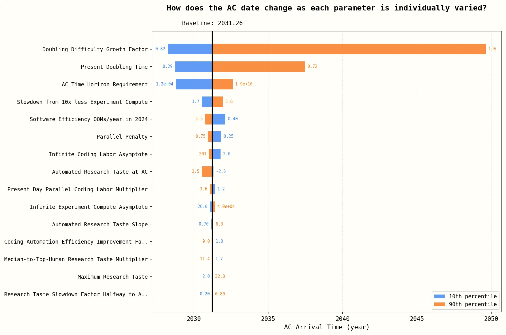

# A simpler model for AI timelines and takeoff

A much simpler model based on the AI Futures Timelines model results in similar timelines, while being more understandable and robust. In particular, at current rates of compute growth and algorithmic progress, there will be 99% automation of AI R&D, 1e3 to 1e8 algorithmic progress, and 300x-3000x research output by 2035, even without full automation or automated research taste.

## Why make this?

- The AI Futures Model (AIFM) has 33 parameters; this has 8
    - The philosophy behind the AIFM is to model AI takeoff in great detail. More complex models can be more accurate, but they can also be prone to overfitting, more sensitive to modeling assumptions, and harder to understand.
- AIFM is extremely sensitive to time horizon in a way I wouldn't endorse.
    - In particular, the "doubling difficulty growth factor", which measures whether time horizon increases superexponentially, could change the date of automated coder from 2028 to 2049! I suspect that time horizon is too poorly defined to nail down this parameter.

## Scope and limitations

This model doesn't treat research taste and software engineering as separate skills/tasks. As such, I see it as making predictions about timelines (time to superhuman AI researcher), not takeoff (time from SAR to ASI and beyond, when increasingly superhuman research taste becomes the primary driver of progress in the AIFM).

This was constructed and written up fairly quickly (about 10 hours of work), so the parameters and some of the modeling assumptions are not super well-considered opinions.

## The model

We assume that AI development has the following dynamics:

- Research progress is Cobb-Douglas between labor and compute
- Software efficiency S follows a Jones model
- The fraction of automatable tasks $f$ increases as a sigmoid in log S
- Zero substitution between tasks
- Labor
    - Humans work on ONLY non-automated tasks
    - Human labor on each task is L/(1-f)
    - AI labor on each task is CS/f, but this doesn't matter because we assume human labor is the bottleneck (since humans work slower than AIs)

This implies the following model:

$$S'(t) = R(t) S^{1 - \beta} = \left(\frac L {1-f}\right)^\alpha C^\zeta S^{1 - \beta}$$

$$f(t) = \sigma(v(\log C(t)S(t) - \log E_{hac}))$$

where

- $S(t)$ is level of software (training+inference efficiency)
    - so $C(t)S(t)$ is the effective compute of the best AI
- L(t) is human labor, specified as an input time series
- C(t) is compute, also an input time series
- $\alpha, \beta, \zeta$ are constant
    - $\alpha$ is diminishing returns to more labor.
    - $\beta$ is the difficulty exponent for software improvement
    - $\zeta$ is direct returns to compute. For software intelligence explosion, this is not relevant
- $E_{hac}$ is the effective compute level of an AI that can automate half of AI R&D tasks.
- v is the automation velocity: S must increase by factor of $e^(1/v)$ to get from 50% to 73% automation

None of the pieces beyond this model are novel, but I haven't seen them written up in this form.

### Differences from AI Futures model

We make a few conservative assumptions
- No full automation: as AIs get more capable, they never automate 100% of AI R&D work, just approach it.
- No substitutability: Automation follows Amdahl's law, with speedup = $1/(1-f)$

The largest other difference is there are no separate coding and research taste skills.

## Observations

- The AI Futures model is complex, but its conclusions are fairly robust to simplifications.
- The two key uncertainties behind timelines are
  - how to measure algorithmic progress
  - how effective compute relates to % automation of real tasks
- At current rates of compute growth and algorithmic progress, there will be 99% automation of AI R&D, 1e3 to 1e8 software efficiency gain, and 300x-3000x research output by 2035, even without full automation or automated research taste. This is clearly transformative AI
  - I don't put too much weight in the exact predicted timelines because I haven't thought much about the exact parameter values
- Even as automation dramatically increases the amount of effective labor, the compute:labor ratio goes UP, because compute is increasing so fast.

## Graphs

TODO

## More on modeling choices

### Parameter values

The parameters are derived from these assumptions:

- The rate of change of S in jan 2026 is 5x/year
- 1/v is between 1.5 and 4.2
    - NB David Rein thinks 2.1 to 4.2
- f was between 0.25-0.5 in jan 2026
- alpha/(alpha + zeta) is between 0.15 and 0.4
- alpha + zeta is between 0.8 and 1
- beta is 0.3 to 1
- all variables triangularly and independently distributed
- L doubling every year until 2029 after which it increases 10%/year
- C tripling every year until 2029 after which the growth rate linearly decreases from 2x to 1.25x/year between 2030 and 2058.

For more information see the notebook: https://github.com/tkwa/ai-takeoff-model/blob/main/takeoff_simulation.ipynb

### How could we better estimate the parameters?

We can get f_2026 [uplift fraction in 2026] from
* transcripts of realistic cursor usage + success judge + difficulty judge calibrated on tasks of known lengths
* uplift study
* asking lab people about their current uplift (since parallel uplift and 1/(1-f) are equivalent in the simple model)

v [velocity of automation as capabilities improve] can be obtained by
* guessing the distribution of tasks, using time horizon, maybe using a correction factor for real vs benchmark time horizon
* multiple uplift studies over time
* comparing older models to newer ones, or having older models try things people use newer models for
* listing how many things get automated each year

### Why is automation logistic?

- A logistic is the simplest choice for anything that maps the reals to (0, 1).
- Intuitively, when AIs are already automating >50% of human research, each unit of capabilities progress will allow automating a constant fraction of remaining labor. The logistic has an exponential tail, which matches this intuition.

### Why are labor and compute Cobb-Douglas?

In the AIFM, the median estimate for substitutabilty between labor and compute is -0.15, and the plausible range includes zero (which would be Cobb-Douglas). I asked Eli why they didn't just say it was Cobb-Douglas, and he said something like Cobb-Douglas giving infinite progress if compute goes to infinity while labor remains constant, which is implausible. I have two responses to this:
- It doesn't seem so implausible to me-- it would take days to weeks to get to ASI given infinite compute, meaning a 100x-1000x speedup, but once there, infinite compute might allow developers to develop algorithms in months that would take humans billions of years with current compute levels
- Labor/compute ratio only changes by ~30x during the period in question, so it doesn't affect results much anyway.

### Why is there no substitutability between tasks?

The AIFM's median was something like $\rho = -2.0$, meaning strong complementarity. So to be conservative, I assumed no substitution effect.